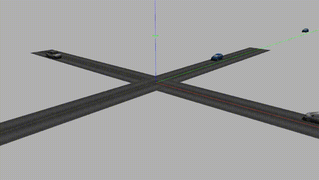

# Planning and Decision Making assignment

Create a planner and controller for controlling the ego vehicle in a simulated intersection scenario. 
The ego vehicle arrives to a 4 way intersection (governed by the European right hand driving traffic rules) and must yield 
to vehicles arriving on the road to its right or pass if the intersection is free. 
The planner should decide whether it is allowed to cross the intersection, given the information about other 
incoming vehicles (their position and speed). The controller must choose an appropriate velocity profile 
for either stopping before the intersection or for passing safely.

## Specification 

 - The scenario modelled is a 4 way intersection governed by the European traffic rules 
– a vehicle must yield to other vehicles arriving from the road on its right. 
The lanes on the incoming roads are given an id between 0 and 3 in a counter-clockwise direction,
so the lane 1 is on the right of lane 0. Each road has exactly one lane in each direction. 
 - A position on the road model is given by an (x, y) coordinate pair. 
The x axis is parallel to lanes 0 and 2, while the y axis is parallel to lanes 1 and 3. 
The centre of the intersection is (0, 0) and the length of the roads is 50 meters in each direction. 
 - In each simulation the ego vehicle (represented by the pickup) starts from a random position on lane 0 
 with an initial velocity in the range 
[5 m/s, 15m/s]. Other vehicles are initialized at random positions on one or more of the other incoming roads.  
 - Both the ego vehicle and all other vehicles are crossing the intersection straight, 
meaning that no vehicles make a turn in the simulation in any direction. 
 - The simulation runs at a frequency of 10Hz (0,1s time steps). In each time step the ego vehicle 
receives the detections of other cars from the simulator, plus its own position and velocity. 
The detections include the position and speed of other vehicles in the field of view of the sensors of the ego vehicle. 
The planner is expected to send the speed of the ego vehicle for the next time step. 
 - The simulation runs in a synchronized mode, so the next time step is only calculated when the response from 
the planner is received (i.e. The simulation is not real time). 
 - All values are given and expected in SI units (meters, seconds and their derived units) 
 - The ego vehicle must obey the following rules: 
   - Avoid collisions with all cars. 
   - Must not make other vehicles brake that are arriving on the road on its right.  
   - Can assume that cars arriving on its left will not make it brake. 
   - The speed must be in the range [0m/s, 20m/s], the acceleration must be in the range [-2m/s2, 2m/s2] 
   and the change of the acceleration (jerk) must be smaller than 0.2m/s2 between two consecutive time steps. 
 - The ego vehicle has two competing objectives that it must optimize for: 
   - Time: Minimize the time, measured by the number of simulation steps, required for crossing the intersection 
   (reaching point (30, 2)). 
   - Comfort: Minimize the total acceleration, measured by the sum of the absolute values of the acceleration. 

## Implementation and submission 

 - A simulator is provided so that you can focus on the planning algorithm. 
 The simulator is implemented using Gazebo, so there are multiple ways for communication between the simulator 
 the planner: you can either implement your solution as a standalone Gazebo client in C++, or use ROS for communication. 
 You are also free to use any other communication method supported by Gazebo. 
 Detailed instructions on running Gazebo are provided in the INSTALL file. 
 - You can choose any programming language for solving the problem. 
 A sample Gazebo client is provided to make it easier to get started. You are allowed to use any necessary 
 libraries and consult online resources while working on the solution. However please note that fully offloading 
 the work to an existing planner implementation is not accepted, as it would make it difficult for us to evaluate 
 your submission – please make sure to implement at least one core part of the solution yourself (either the planner, 
 the prediction or the rule evaluation algorithm). 
 - Gazebo uses a publish-subscribe model for communication. The simulator publishes the world state on the topic 
 "\~/world_state" and waits for a response on the topic "\~/client_command". If no response is received within 5 seconds 
 then the simulator assumes that the client has disconnected and resets the world. 
 If the ego vehicle reaches its goal, collides with another car, or the maximum simulation time of 150 
 is reached then the world is reset and a new simulation begins. After every reset the simulator sends 
 a summary message on the topic "\~/statistics" describing the last simulation round. Specification of the 
 message format can be found in the `msgs` folder.
 - Please submit the code you have developed and a short summary describing your solution (max 1 page PDF) by 
 sending a link to a shared version control repository (GitHub, BitBucket or similar provider). 
 Please submit the full source code (including all dependencies required to compile/run the program) and 
 exact specification on how to run it. In the description please make sure to describe how you expressed the rules, 
 how predictions for other vehicles are taken into account and how the objectives are minimized. 
 - If you have any questions about the specification, or if you run into any problems running the simulation, 
 please do not hesitate to contact us! 

## Evaluation criteria 

We are confident that you can solve the task and are mostly interested in how you develop your solution. 
Your submission will be evaluated along the following criteria: 
 - Sound design – Is the chosen algorithm well suited to solving the problem at hand? Are the advantages 
 and disadvantages correctly weighted? 
 - Code quality – Is the code easy to understand, commented and correct? Are the most important parts tested in some way? 
 - Choice and correct use of tools – Does the solution use the relevant standard tools (e.g. math libraries)? 
 Does it avoid reinventing the wheel? 
 - Implementation and correctness of at least one core part/algorithm - Does the solution contain the implementation 
 of at least one core part of the algorithm (either the planning, prediction or the rule evaluation part)?  