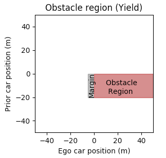
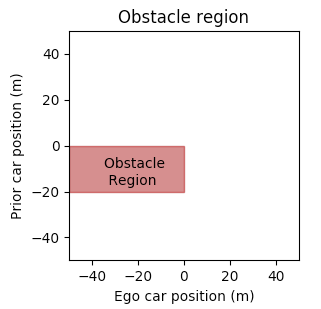

# Multi-Vehicle Intersection planning with MPC approach for autonomous vehicles

  

# Simulation scenario 
 - The scenario modelled is a 4 way intersection governed by the European traffic rules 
– a vehicle must yield to other vehicles arriving from the road on its right. 
The lanes on the incoming roads are given an id between 0 and 3 in a counter-clockwise direction,
so the lane 1 is on the right of lane 0. Each road has exactly one lane in each direction. 
 - A position on the road model is given by an (x, y) coordinate pair. 
The x axis is parallel to lanes 0 and 2, while the y axis is parallel to lanes 1 and 3. 
The centre of the intersection is (0, 0) and the length of the roads is 50 meters in each direction. 
 - In each simulation the ego vehicle (represented by the pickup) starts from a random position on lane 0 
 with an initial velocity in the range 
[5 m/s, 15m/s]. Other vehicles are initialized at random positions on one or more of the other incoming roads.  
 - Both the ego vehicle and all other vehicles are crossing the intersection straight, 
meaning that no vehicles make a turn in the simulation in any direction. 
 - The simulation runs at a frequency of 10Hz (0,1s time steps). In each time step the ego vehicle 
receives the detections of other cars from the simulator, plus its own position and velocity. 
The detections include the position and speed of other vehicles in the field of view of the sensors of the ego vehicle. 
The planner is expected to send the speed of the ego vehicle for the next time step. 
 - The simulation runs in a synchronized mode, so the next time step is only calculated when the response from 
the planner is received (i.e. The simulation is not real time). 
 - All values are given and expected in SI units (meters, seconds and their derived units) 
 - The ego vehicle must obey the following rules: 
   - Avoid collisions with all cars. 
   - Must not make other vehicles brake that are arriving on the road on its right.  
   - Can assume that cars arriving on its left will not make it brake. 
   - The speed must be in the range [0m/s, 20m/s], the acceleration must be in the range [-2m/s2, 2m/s2] 
   and the change of the acceleration (jerk) must be smaller than 0.2m/s2 between two consecutive time steps. 
 - The ego vehicle has two competing objectives that it must optimize for: 
   - Time: Minimize the time, measured by the number of simulation steps, required for crossing the intersection 
   (reaching point (30, 2)). 
   - Comfort: Minimize the total acceleration, measured by the sum of the absolute values of the acceleration. 

# Algorithm description
This intersection includes 2 main steps : 
1. Decide the prior car among all coming cars and predict its movements. 
2. Set the velocity to the ego car using MPC with information from step 1.

The workflow of the code can be expressed as follows:
1. (SetPriorCar function) Decide which car is the prior car with all the states from coming cars and a defined yield line.
2. (MakeDecision function) Make action decision based on the state of the prior car, either pass or yield.
3. (PredictEgocarAcc function) Predict the possible accelerations that will not cause collision
4. (CalculateCost function) Calculate the cost for each possible acceleration
5. (SetVel function) Set the velocity to the ego car with minimum cost
6. Start over with step 1

### Principle of choosing prior car
First set a yield line distance from the intersection, the cars between yield line and intersection will be yielded call Prior_Yield, and cars behind the yield line are the ones that can be surpassed called Prior_Surpass.
So it can be 3 case:

1. There are only Prior_Yield cars: in this case the prior car will be the one that is furthest from the intersection.
2. There are only Prior_Surpass cars: in this case the prior car will be the one that is closest from the intersection as it might cross the yield line.
3. There are Prior_Surpass cars also Prior_Yield cars : in this case we need to check if the distance between the first car of Prior_Surpass cars and the last car of Prior_Yield cars less than yield line value. If so then the first car of Prior_Surpass cars is prior car, otherwise the last car of Prior_Yield cars is the prior car.

### Principle of setting obstacle region
If the ego car decides to yield , then the obstacle region is like the figure on the left, it means the ego car should avoid getting into margin area before the prior car passes.

If it decides to surpass, then then the obstacle region is like the figure on the right, it means the ego car should cross the intersection as soon as possible.
(Here the yield line is set as 20 meters)

# Results and Rule Evaluation
As all the cars are initialized randomly, so the ego car can be placed really close to the intersection, in this case it cannot strictly obey the European right hand driving traffic rules. Sometimes the prior car waits for its own prior car and takes long time, in order to pass the intersection before timeout, the ego car needs to acceleration to pass instead of waiting for the prior car. Two cases are studied, one is that it strictly obey the right hand rules, so it will apply emergency brake(in the code turn on ApplyEBrake) at some point and violate the constraints. Second one follows strictly the constraints, preventing collisions by observing the prior car’s velocity.
### Simulation results (No. of success/ episode):
1. Follow strictly right hand rules : 113/125 (90.4%)
2. Follow strictly constraints : 118/125 (94.4%)
